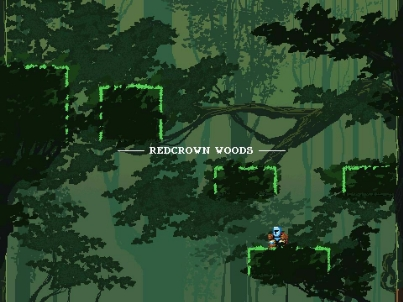
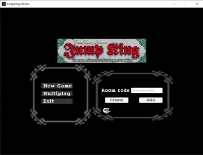

**JUMPKING ONLINE WITH UNITY** 

Mục lục 

1. [**Định nghĩa.................................................................................................................................................................... 3**](#_page2_x97.00_y71.00)
1. [**Giới thiệu** ............................................................................................................... 3](#_page2_x97.00_y94.00)
1. [**Tổng quan về trò chơi** ........................................................................................ 3](#_page2_x97.00_y114.00)
1. [**Giới thiệu về trò chơi** ......................................................................................... 3](#_page2_x97.00_y223.00)
2. [**Gameplay** ............................................................................................................... 4](#_page3_x97.00_y363.00)
2. [**Triển khai ..................................................................................................................................................................... 4**](#_page3_x97.00_y535.00)
1. [**Tính năng** ............................................................................................................... 4 ](#_page3_x97.00_y556.00)[Một số hình ảnh minh họa: ....................................................................................... 5](#_page4_x97.00_y71.00)
1. [**Mô hình phân rã chức năng (BFD)** ........................................................................ 6](#_page5_x97.00_y354.00)
1. [**Cấu trúc gói tin** ...................................................................................................... 7](#_page6_x97.00_y71.00)
1. [**Client đến Server** ................................................................................................ 7](#_page6_x97.00_y227.00)
1. [**Server đến Client** ................................................................................................ 8](#_page7_x97.00_y106.00)
4. [**Network stack** ........................................................................................................ 9](#_page8_x97.00_y71.00)
3. [**Phân chia công việc ................................................................................................................................................. 11**](#_page10_x97.00_y71.00)
1. **Định nghĩa** 
1. **Giới thiệu** 
1. **Tổng quan về trò chơi** 
   1. **Jumpking** là một trò chơi trực tuyến được phát bởi Nexile và được phát hành trên nền tảng Steam vào ngày 09/06/2019. 
   1. Trong trò chơi, bản đồ của game ở dạng thẳng đứng. Do đó, người chơi phải cẩn trọng trong từng bước nhảy, tránh việc bị ngã từ trên cao. 
1. **Giới thiệu về trò chơi** 
- **Nhân vật:** King và Knight.** 

*Figure 1: Knight character* 

*Figure 2: King character* 

- **Bản đồ:** Redcrow Woods.** 

*Figure 3: Redcrow Woods map* 

2. **Gameplay**  
- Số lượng người chơi trong một phòng: 2. 
- Sau khi nhập mã phòng, người chơi sẽ được đưa vào lobby, host sẽ có quyền bắt đầu trò chơi. 
- Khi vào game, người chơi sẽ được spawn vào bản đồ game. 
- Bản đồ sẽ bao gồm:  
  - Block. 
  - Building object. 
  - Npc. 
- Người chơi nào lên được đỉnh tháp trước sẽ là người chiến thắng. 
2. **Triển khai** 
1. **Tính năng** 
- Tạo phòng chơi với số lượng người chơi là 2 (1 host). 
- Tham gia phòng chơi bằng code (1 client). 
- Tạo lobby, relay.  
- Tạm dừng game. 

**Một số hình ảnh minh họa:**  

*Figure 4: Create and Join game room* 

*Figure 5: Game lobby* 

*Figure 6: Pause game* 

2. **Mô hình phân rã chức năng (BFD)** 

*Figure 7: Game BFD* 

3. **Cấu trúc gói tin** 
- **Thư viện:** *Unity Netcode*, *Unity Relay*, *Unity Lobby* 
- **Chức năng:**  
- Đồng bộ vị trí *Player*.** 
- Đồng bộ *Animation*.** 
- Tạo kết nối.** 
- Tạo phòng chờ.** 
- Kết nối *Player* vào *Server* thông qua *Unity Services* (Global Hosting).** 
1. **Client đến Server** 

|**Control Message:**  Connect/Disconnect/Data/ |**Length:** 6144 bytes |
| :- | - |
|**Sender:** Client** |**Receiver:** Server** |
|**Body** ||

|**Packet** |||||
| - | :- | :- | :- | :- |
|NetworkObjectId |Position |Rotation |Scale |State |

*Source: NetworkObject.cs* 

- **Giải nghĩa**: 
- *Connect*: người chơi yêu cầu kết nối vào Server. 
- *Disconnect*: người chơi yêu cầu rời Server. 
- *Data*: người chơi gửi thông tin trong Packet. 
- *NetworkObjectId*: Id của người chơi. 
- *Position*: Vị trí người chơi hiện tại. 
- *Rotation*: Trạng thái xoay của người chơi, cố định giá trị (0,0,0). 
- *Scale*: Trạng thái lật của người chơi, di chuyển sang phải (1,1,1), di chuyển sang phải (-1,1,1). 
- *State*: hoạt ảnh hiện tại, gồm 5 hoạt ảnh {idle, run, hold, jump, fall}. 
2. **Server đến Client**  

|**Control Message:**  IsServer/IsClient/IsListening/ IsApproved |**Length:** 6144 bytes |
| :-: | - |
|**Sender:** Server |**Receiver:** Client |
|**Body** ||

|**Packet** ||||
| - | :- | :- | :- |
|LocalClientId |NetworkPrefabs |NetworkTransform |NetworkAnimator |

- **Giải nghĩa:** 
- *IsServer*: kiểm tra xem có phải là Server. 
- *IsClient*: kiểm tra nếu là người chơi. 
  - Trong đồ án này, Host sẽ là Server đồng thời cũng là Client. 
- *IsListening*: kiểm tra xem Server có đang mở kết nối. 
- *IsApproved*: kiểm tra người chơi có được chấp nhận. 
- *LocalClientId*: Id của người chơi, được cấp bởi Server thông qua NetworkObjectId. 
- *NetworkPrefabs*: Nhân vật của người chơi. 
- *NetworkTransform*: Vị trí người chơi được trả về, bao gồm: 
  - *Position* 
  - *Rotation* 
  - *Scale* 
- *NetworkAnimator*: Hoạt ảnh nhân vật được trả về, bao gồm: 
  - *Sprite* 
  - *Animation* 
- Đối với mỗi lần gửi, Server sẽ gửi cho (n – 1) gói tin cho (n) người chơi.  
4. **Network stack**  

***(Xem ở trang kế tiếp …)*** 

3. **Phân chia công việc** 

|**MSSV** |**Họ tên** |**Công việc** |**% Công việc** |
| - | - | - | - |
|21522797 |Lê Huỳnh Quang Vũ |
- Thiết kế gameplay, lập trình logic game. 

- Thiết kế mạng, lập trình mạng. 

- Thuyết trình. 

- Làm báo báo. 
|100% |

***Video demo*:[ https://drive.google.com/file/d/1auDn2UTejUFmqPWJiGwy- PbYFSz_Qs_t/view?usp=sharing ](https://drive.google.com/file/d/1auDn2UTejUFmqPWJiGwy-PbYFSz_Qs_t/view?usp=sharing)**

***Source code:[*** JumpKing-Online/Assets at master · tuitenrein/JumpKing-Online (github.com) ](https://github.com/tuitenrein/JumpKing-Online/tree/master/Assets)***
11 